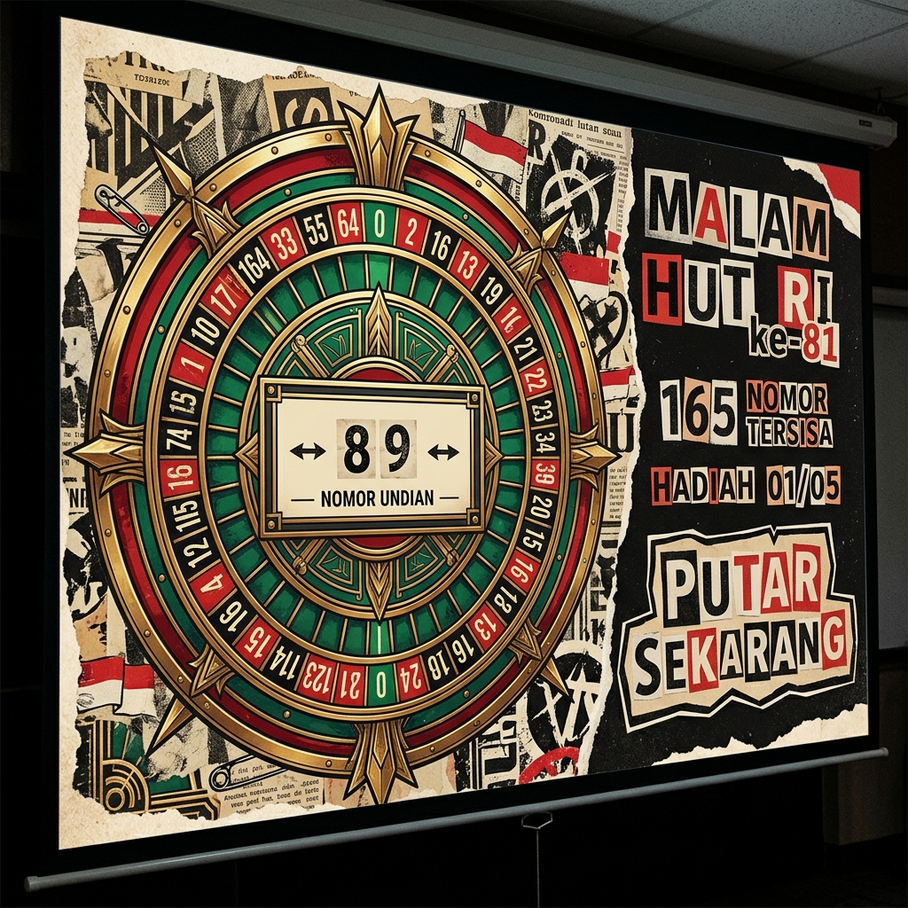

# Undian HUT RI ke-81 — Griya Shanta RT 08



Aplikasi undian (raffle) *offline-first* yang dibangun khusus untuk malam perayaan HUT Kemerdekaan RI ke-81 di Griya Shanta RT 08. Dirancang untuk dijalankan lewat laptop dan proyektor, aplikasi ini memadukan estetika *Art Deco / Vegas casino* dengan *punk-subculture collage* agar acara pengundian terasa lebih megah dan seru.

Aplikasi ini menggunakan teknologi **Progressive Web App (PWA)** sehingga aman dari gangguan internet/Wi-Fi yang sering putus saat acara berlangsung.

## ✨ Fitur Utama
- **Estetika Proyektor-First**: Layout asimetris 16:9 yang terbaca jelas dari jauh tanpa menggunakan elemen antarmuka yang mengganggu.
- **Undian Bebas Bias & Anti-Repetisi**: Menggunakan algoritma pengacakan berbasis kriptografi (`crypto.getRandomValues`) untuk memilih satu pemenang dari nomor kavling yang aktif. Nomor yang sudah menang akan dicabut dari *pool* undian selanjutnya.
- **Tahan Banting & Recovery**: Semua state pengundian langsung disimpan secara reaktif ke `localStorage`. Jika laptop *hang*, tertutup tidak sengaja, atau di-refresh paksa, aplikasi akan memulihkan pemenang dan urutan undian yang persis sama.
- **100% Siap Offline**: Setelah di-install pertama kali secara online, aplikasi ini tidak lagi membutuhkan koneksi internet, tidak memuat font dari luar, dan murni jalan di dalam peramban lokal.

## 🛠 Instalasi dan Panduan Setup (Local Development)

Proyek ini menggunakan [Bun](https://bun.sh/) untuk manajemen paket dan eksekusi skrip, serta [Astro](https://astro.build/) untuk bundel statis tanpa *runtime* server (Zero JS Server).

1. Install Bun jika belum punya:
   ```bash
   curl -fsSL https://bun.sh/install | bash
   # Atau via PowerShell di Windows:
   # powershell -c "irm bun.sh/install.ps1 | iex"
   ```
2. Clone repositori ini dan install dependencies:
   ```bash
   git clone https://github.com/Ruphasa/hutri81-roulette.git
   cd hutri81-roulette
   bun install
   ```
3. Jalankan development server lokal:
   ```bash
   bun run dev
   ```
4. Verifikasi dan jalankan testing suite (Unit Test & Playwright E2E):
   ```bash
   bun run check
   bun run test
   ```
5. Build hasil rilis produksi:
   ```bash
   bun run build
   ```

## ⚙️ Cara Mengubah Data Nomor Kavling dan Hadiah

Semua pengaturan acara dan data undian ada di satu file: `src/config/event.ts`.
- **`lotRanges`**: Tentukan blok dan nomor kavling (contoh: `A01` sampai `A25`). Aplikasi akan otomatis membongkar (*expand*) rentang ini menjadi array lot yang lengkap.
- **`prizes`**: Tambahkan daftar urutan hadiah, mulai dari hadiah utama atau hadiah hiburan sesuai rundown.

## 📱 Panduan Operator Hari H (Rehearsal Airplane Mode)

Sebagai langkah pengamanan ganda untuk operator lapangan:
1. Pastikan laptop tersambung Wi-Fi di rumah atau di balai RW. Buka *production URL* Vercel.
2. Tunggu indikator status di bagian kiri bawah berubah menjadi **Siap Offline**.
3. Install aplikasi ke sistem (klik ikon *Install App* di pojok kanan *address bar* Chrome/Edge, atau pilih "Install" di menu).
4. **Matikan Wi-Fi laptop (hidupkan Airplane Mode)**.
5. Buka aplikasi HUT RI 81 Roulette dari Desktop / Start Menu.
6. Lakukan simulasi memutar satu hadiah untuk memastikan semua aset animasi dan data sudah masuk lokal.
7. Aplikasi siap dipakai langsung saat acara malam!

## 🏗 Arsitektur dan Peta Modul

Aplikasi ini menggunakan perpaduan **Astro**, **Bun**, dan **Vanilla TypeScript**.

- **`src/config/event.ts`**: Identitas acara, rentang nomor, dan daftar hadiah.
- **`src/domain/`**: Modul fungsional murni untuk ekspansi lot (`lot-generation`), seleksi pemenang anti-bias (`random-selection`), dan *state machine* putaran (`raffle-machine`).
- **`src/lib/persistence.ts`**: Serialisasi versioning dan sistem proteksi *incompatible state recovery*.
- **`src/client/raffle-controller.ts`**: Skrip orchestrator yang menjembatani *state machine*, animasi web (`roulette-motion.ts`), interaksi klik/keyboard, DOM mutation, dan *persistence*.
- **`src/pages/` dan `src/components/`**: Markup presentasional murni via `.astro`. Semua styling di-handle via Vanilla CSS (`src/styles/raffle.css`).
- **`tests/`**: Kumpulan end-to-end verifikasi untuk aliran normal maupun skenario offline/refresh menggunakan **Playwright**.

## ☁️ Deployment (GitHub & Vercel)

Repositori ini siap di-*deploy* langsung ke **Vercel** karena target rilisnya statis dan tidak memerlukan adapter *serverless*.
- **Framework Preset**: Astro
- **Install Command**: `bun install`
- **Build Command**: `bun run build`
- **Output Directory**: `dist`

Tiap kali branch baru di-*push* ke GitHub, Vercel akan membuatkan environment *preview* untuk verifikasi. *Merge* ke branch `main` akan langsung ter-publish ke *production*.

## 🖋 Attribusi

Aplikasi ini mendistribusikan tiga paket *open-source font* bebas lisensi (OFL) secara bundel mandiri (Self-Hosted):
- **Limelight** (Tampilan Deco Utama)
- **Bowlby One SC** (Aksen gaya Cut-Paper / Ransom-Note)
- **Barlow Condensed** (Tipografi status fungsional / informasi baca jarak jauh)
