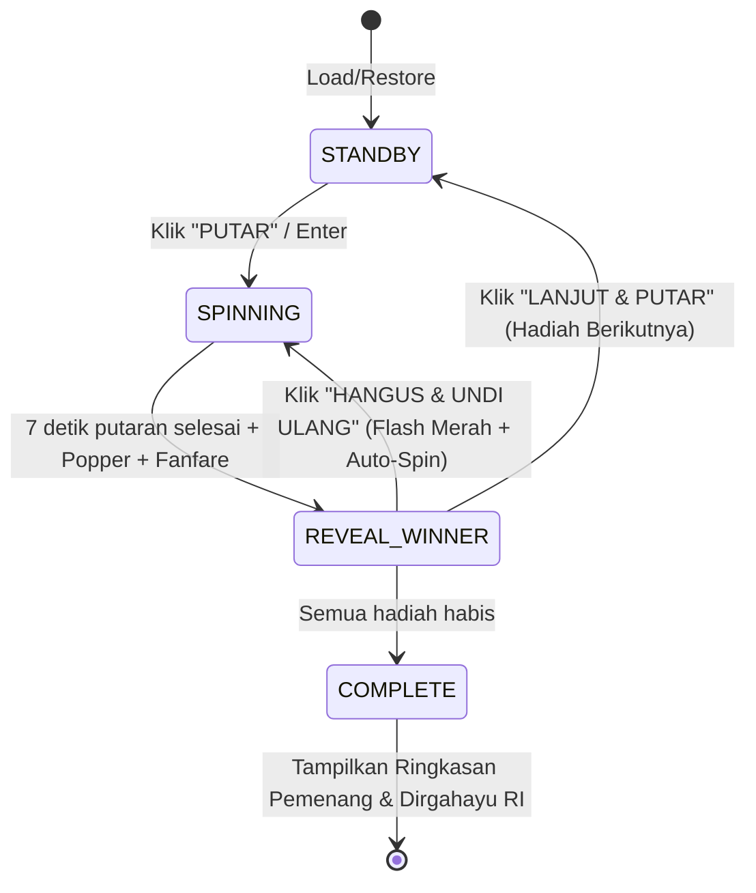

# Design Specification: Stage Mode Experience & Enhanced Flow

**Date:** 2026-08-19  
**Event:** Malam Puncak HUT RI ke-81 Griya Shanta RT 08  
**Target:** Proyektor Panggung / TV 16:9 Landscape  

---

## 1. Executive Summary & Goals

Aplikasi undian roulette ditransformasikan dari tampilan *dashboard* menjadi **Layar Panggung Interaktif ("Stage Mode")** yang dioptimalkan untuk proyeksi TV/proyektor berjarak pandang 8–10 meter.

### Key Objectives
1. **Layar Panggung Dominan (70/30 Split)**: Roda dan nomor pemenang menguasai ~70% layar landscape. Huruf dan nomor kavling membesar secara masif (minimal 1/4 tinggi layar saat menang). Panel operator menyusut ke sisi kanan (~30%).
2. **Suspenseful Rolling Timing**: Durasi putaran diperpanjang (6.5–7.5 detik) dengan perlambatan gradual yang menegangkan.
3. **Party Popper / Confetti Celebration**: Ledakan confetti/popper bertema Merdeka (merah, putih, emas) saat nomor terkunci.
4. **Dramatic Forfeit**: Efek kilat merah dan audio hangus saat pembatalan, dilanjutkan *auto-respin* seketika.
5. **Sound Engine (Web Audio API - 100% Offline)**: Efek suara ticking mekanik, impact lock, dan fanfare selebrasi yang dapat dimatikan via tombol Mute.
6. **Hidden Operator Reset**: Tombol reset berbahaya disembunyikan di balik klik ornamen diamond kiri atas.
7. **Complete Event Flow (Standby -> Reveal -> Finale)**: Layar pembuka (Standby), pengumuman pemenang dramatis, dan layar penutup (Grand Finale).
8. **Multi-Session Compatibility**: Arsitektur data siap menampung konfigurasi Sesi 1 (Hadiah Hiburan/Kecil) dan Sesi 2 (Hadiah Utama) saat daftar hadiah telah final.

---

## 2. Layout & Visual Hierarchy (Stage Mode)

```
+-----------------------------------------------------------------------------------------------+
| [♦] (Hidden Reset)  GRIYA SHANTA RT 08                      [ 🔊 MUTE ] [164 NOMOR TERSISA]   |
+-------------------------------------------------------------+---------------------------------+
|                                                             |  MALAM UNDIAN MERDEKA           |
|                                                             |                                 |
|                       ROULETTE WHEEL                        |  [ SEDANG DIUNDI ]              |
|                          (~70vw)                            |  HADIAH #02: KIPAS ANGIN        |
|                                                             |                                 |
|                     +-----------------+                     |  PUTAR RODA. TAHAN NAPAS.       |
|                     |                 |                     |                                 |
|                     |     L - 123     | (>= 25vh hero text) |  +---------------------------+  |
|                     |                 |                     |  |     PUTAR SEKARANG (▶)    |  |
|                     +-----------------+                     |  +---------------------------+  |
|                                                             |  | [HANGUS & UNDI ULANG] (opt)| |
|                                                             |  +---------------------------+  |
|                                                             |  [Enter - Kontrol Utama]        |
|                                                             |                                 |
|  sekali putar, satu pemenang!                               |  [Status Offline Ready ✓]       |
+-------------------------------------------------------------+---------------------------------+
```

### 2.1. Komponen Kiri (The Arena / ~70vw)
- **Wheel Scale**: SVG Wheel diperbesar memenuhi porsi vertikal (~85vh).
- **Badge Center & Winner Display**:
  - Ukuran font nomor kavling diperbesar menjadi `min(8vw, 16vh)` agar terbaca jelas dari belakang ruangan.
  - Selama fase `REVEAL_WINNER`, badge pemenang membesar (*pulse/scale up*) dengan border emas menyala.
- **Confetti Canvas**: Layer canvas transparan di atas roda yang menembakkan partikel confetti/popper saat nomor terkunci.

### 2.2. Komponen Kanan (The Control & Info Panel / ~30vw)
- **Top Bar Right**: Indikator kavling tersisa + Tombol toggle Mute Audio (`🔊 / 🔇`).
- **Prize Card**: Menampilkan hadiah aktif secara mencolok (e.g., `HADIAH 02/05: KIPAS ANGIN MASPION`).
- **Operator Actions**:
  - Tombol aksi utama tunggal (`PUTAR SEKARANG` -> `MEMUTAR...` -> `LANJUT & PUTAR`).
  - Tombol `HANGUS & UNDI ULANG` (hanya muncul saat pemenang aktif).
- **Hidden Reset**: Tombol `.top-left-diamond` berfungsi sebagai tombol rahasia untuk memicu dialog konfirmasi Reset.

---

## 3. Motion & Audio Choreography

### 3.1. Timing & Animation Curve
- **Durasi Putaran**: 7000ms.
- **Roda SVG**: `easeOutElastic(1, 0.75)` untuk mempertahankan sentakan fisik roda di akhir.
- **Teks Nomor (Odometer Loop)**: `easeOutCubic` (monoton maju tanpa loncat mundur) membaca `fullPool` secara sekuensial.
- **Fase Perlambatan**: 3 detik pertama berputar cepat (blur counting), 3 detik kedua melambat drastis (angka terbaca satu per satu), 1 detik terakhir mengunci ke pemenang dengan dentuman.

### 3.2. Offline Web Audio Engine
Menggunakan Web Audio API sintetis (tanpa file audio eksternal berat agar 100% offline dan instan):
1. **Tick Sound**: Frekuensi oscillator singkat per pergantian tick nomor (tempo melambat mengikuti easing).
2. **Lock Impact**: Low-frequency heavy boom (bass drum + metallic ping) saat angka pemenang terkunci.
3. **Winner Fanfare / Cheer**: Serangkaian nada kemenangan ceria (arpeggio mayor sintetis) mengiringi semburan confetti.
4. **Forfeit Buzz**: Nada dissonance pendek mengiringi kilat merah saat undian dihanguskan.
5. **Mute State**: Disimpan di `localStorage` agar status audio persisten saat refresh.

### 3.3. Confetti / Popper Effect
- Menggunakan library partikel ringan (atau canvas particle native).
- Warna partikel: Crimson Red (`#dc2626`), Pure White (`#ffffff`), Vibrant Gold (`#facc15`), Emerald (`#10b981`).
- Pola ledakan: Tembakan dua arah dari sudut bawah roda menuju ke atas layar lalu jatuh perlahan (gravity + air resistance).

---

## 4. State Flow & Edge Cases

### 4.1. Siklus Fase


### 4.2. State Baru
- **`STANDBY`**: Layar siap undi hadiah tertentu. MC dapat memandu penonton melihat hadiah apa yang diperebutkan sebelum tombol ditekan.
- **`COMPLETE (Grand Finale)`**:
  - Roda berhenti, layar memunculkan overlay megah bertuliskan **"SELURUH HADIAH TELAH DIUNDI"**.
  - Rekap nama pemenang 1 s.d. selesai.
  - Ucapan: *"Dirgahayu Republik Indonesia ke-81 — Griya Shanta RT 08"*.

---

## 5. Security & Operator Safety
1. **Anti-Mistake Reset**: Reset tidak lagi memiliki tombol yang tampak di UI biasa. Hanya bisa dibuka dengan klik pada ornamen diamond di pojok kiri atas dan harus dikonfirmasi melalui dialog.
2. **State Persistence**: Seluruh state (`phase`, `winners`, `activeLots`, `prizeIndex`) tetap tersimpan di `localStorage` dan tahan terhadap refresh/crash browser.
3. **Full Offline PWA**: Seluruh aset visual, ikon, partikel canvas, dan audio generator bekerja 100% tanpa internet.

---

## 6. Implementation Readiness
- File rencana kerja (*implementation plan*) akan disusun melalui skill `writing-plans` setelah dokumen spesifikasi ini diverifikasi.
- Sesi hadiah (Kecil vs Besar) akan dieksekusi sebagai parameter konfigurasi event begitu daftar kuota hadiah dari panitia sudah fix.
